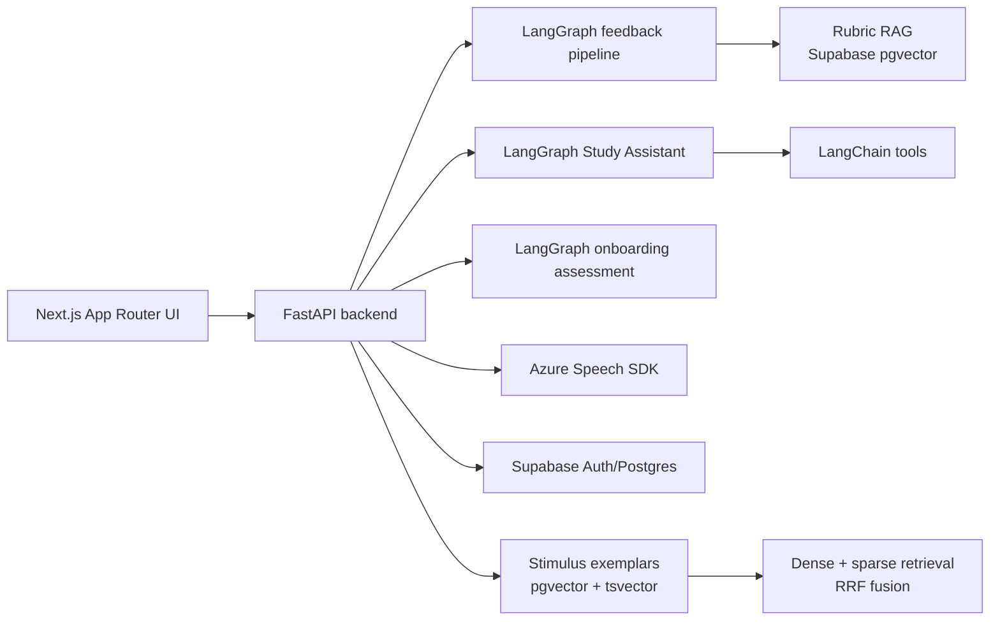
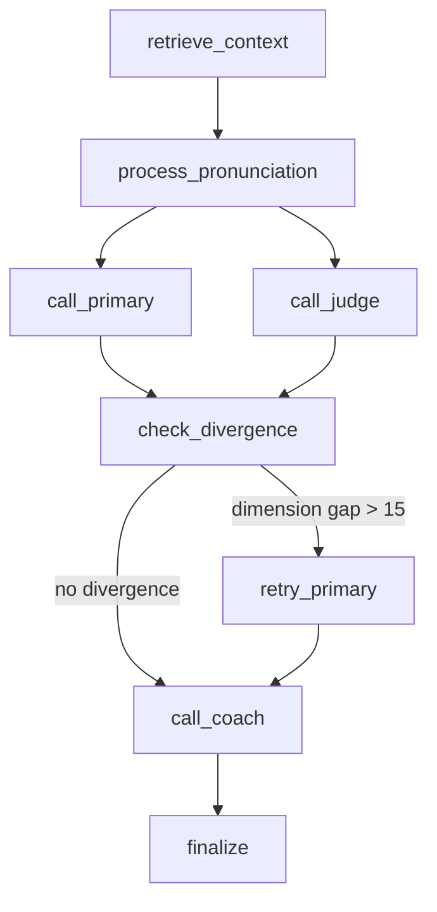

# EchoLingo

EchoLingo is an AI-powered PTE Academic practice platform. It combines
LangGraph agent workflows, rubric-grounded feedback, exemplar-grounded practice
generation, Azure speech assessment, and a full-stack web app for repeatable PTE
practice.

This is a personal full-stack / AI agent engineering project built to explore
how LLM applications can move beyond single prompt calls into testable,
observable, tool-using workflows.

> EchoLingo does not replicate Pearson's official scoring algorithm. Scores and
> feedback are practice-oriented estimates. Azure Pronunciation Assessment is
> used as an objective signal for supported spoken tasks.

## Highlights

- 15 PTE Academic task types across Speaking & Writing, Reading, and Listening.
- Full Mock Exam flow with a 15-task sequence and a summary page.
- LangGraph feedback pipeline with RAG, LLM-as-Judge, conditional retry, and
  coach suggestions.
- Study Assistant with LangChain tools for app navigation, practice generation,
  and PTE knowledge Q&A.
- Onboarding assessment agent that scores diagnostic tasks in parallel and
  generates a first-week learning plan.
- Dual retrieval system: scoring rubrics plus stimulus exemplars.
- Theme Practice using pgvector dense retrieval, Postgres full-text search, and
  Reciprocal Rank Fusion in a single SQL query.
- Local originality guard using word-shingle Jaccard overlap to reduce exemplar
  regurgitation.
- Azure Neural TTS and Azure Pronunciation Assessment with word-level and
  phoneme-level feedback.
- FastAPI as the single authoritative backend; Next.js calls the Python backend
  directly.
- Broad test coverage: backend pytest, frontend unit tests, and Playwright E2E
  tests.

## Tech Stack

**Core:** FastAPI, LangGraph, LangChain, Supabase PostgreSQL/pgvector,
DashScope Embeddings, Azure Speech SDK, Next.js, TypeScript

**Testing:** pytest, Vitest, Playwright

**Development workflow:** Claude Code with ECC-assisted planning, verification,
review, and documentation. Product scope and architecture decisions remain
explicit repository artifacts rather than session-only context.

## Product Scope

EchoLingo supports these PTE Academic practice flows:

| Area | Features |
| --- | --- |
| Practice | Individual task practice, Theme Practice, Targeted Practice |
| Mock Exam | 15-task sequence covering all implemented PTE task types |
| Feedback | Structured AI feedback, dimension scores, suggestions, coach tips |
| Speech | Azure TTS stimuli and pronunciation assessment |
| Study Aid | Study Assistant, word lookup, vocabulary list |
| Progress | History, task-type weakness profile, trends, recommendations |
| Platform | Supabase auth/sync, i18n, PWA, responsive UI |

Implemented task types:

- Read Aloud
- Repeat Sentence
- Answer Short Question
- Summarize Written Text
- Write Essay
- Personal Introduction
- Describe Image
- Re-tell Lecture
- Fill in the Blanks (Reading)
- Re-order Paragraphs
- Multiple Choice (Reading)
- Summarize Spoken Text
- Fill in the Blanks (Listening)
- Highlight Correct Summary
- Write from Dictation

## Architecture



The frontend does not own LLM or third-party business logic. All secrets and
agent orchestration live in the Python backend. Browser requests go through the
FastAPI base URL configured by `NEXT_PUBLIC_API_BASE_URL`.

## Agent Workflows

### 1. Feedback Scoring Pipeline

Implemented in `backend/services/feedback_graph.py`.



Key behavior:

- Retrieves scoring rubric context before the primary scoring call.
- Runs Primary and Judge LLM calls in parallel.
- Detects dimension-level score divergence above 15 points.
- Retries the primary scoring call once when divergence is detected.
- Calls a coach node with tools for historical weaknesses and rubric lookup.
- Emits structured feedback, `judgeLog`, `coachSuggestions`, and per-request
  observability logs such as `task_type`, `rag_chars`, `diverged`, and
  `retry_count`.

### 2. Study Assistant

Implemented in `backend/services/study_assistant_graph.py` and
`backend/tools/study_assistant_tools.py`.

The Study Assistant is a multi-turn tool-using helper with three LangChain
tools:

- `navigate_app`: returns app navigation help from an allow-listed route map.
- `generate_practice`: creates deep links into topic-based text task practice.
- `pte_knowledge`: answers PTE format, scoring, timing, and strategy questions.

The tool loop is capped at four iterations. Routes are filtered through an
allow-list so the model cannot invent application paths. Topic practice defaults
to exemplar-grounded generation and switches to news-grounded generation only
when the latest user message contains an explicit recency cue.

### 3. Onboarding Assessment

Implemented in `backend/services/onboarding_graph.py`.

The onboarding graph:

1. Scores multiple diagnostic responses in parallel with `asyncio.gather`.
2. Synthesizes a section-level weakness profile with an LLM.
3. Generates a personalized first-week learning plan.

## RAG and Retrieval

EchoLingo uses two retrieval surfaces:

| Collection | Purpose | Implementation |
| --- | --- | --- |
| Rubric chunks | Ground feedback in task-specific scoring criteria | Supabase pgvector via `backend/services/rag.py` |
| Stimulus exemplars | Seed realistic practice stimulus generation | Dedicated Postgres table with pgvector + `tsvector` |

Theme Practice uses hybrid retrieval:

- dense similarity: pgvector cosine distance over DashScope 1024-dim embeddings
- sparse retrieval: Postgres full-text search with `tsvector`
- fusion: Reciprocal Rank Fusion
- execution: single SQL query in `backend/services/exemplar_store.py`

Generated stimuli pass through a local originality guard in
`backend/services/originality.py`. It computes 4-gram word-shingle Jaccard
overlap against injected exemplars and triggers one regeneration if overlap is
above `0.5`.

## Repository Structure

```text
backend/
  main.py                    FastAPI app entry point
  routers/                   HTTP endpoints
  services/                  Agent graphs, RAG, speech, stimulus generation
  tools/                     LangChain tools
  prompts/                   YAML prompts and knowledge files
  scripts/                   Rubric/exemplar ingestion and evaluation scripts
  tests/                     pytest suite

src/
  app/                       Next.js App Router pages
  components/                Shared UI components
  hooks/                     Practice and recording lifecycle hooks
  lib/                       API client, task bank, history, recommendations
  locales/                   English and Chinese UI strings
  types/                     Shared TypeScript types

docs/
  adr/                       Architecture decision records
  PROJECT_CONTEXT.md         Current project context and architecture notes
  DEVELOPMENT_LOG.md         Development log
  ROADMAP.md                 Current phase and strategic priorities
```

## Getting Started

### Prerequisites

- Node.js 20+
- Python 3.11+
- Supabase project with required migrations applied
- OpenAI-compatible chat model credentials
- DashScope API key for embeddings
- Azure Speech Services key and region for speech features

### Frontend Setup

```bash
npm install
cp .env.example .env.local
```

Required frontend environment:

```env
NEXT_PUBLIC_SUPABASE_URL=
NEXT_PUBLIC_SUPABASE_ANON_KEY=
NEXT_PUBLIC_API_BASE_URL=http://localhost:8000
```

Run the frontend:

```bash
npm run dev
```

### Backend Setup

```bash
cd backend
python -m venv .venv
source .venv/bin/activate
pip install -r requirements.txt
cp .env.example .env
```

Required backend environment:

```env
LLM_API_KEY=
LLM_BASE_URL=https://api.deepseek.com
LLM_MODEL=deepseek-chat

AZURE_SPEECH_KEY=
AZURE_SPEECH_REGION=

SUPABASE_URL=
SUPABASE_ANON_KEY=
SUPABASE_SERVICE_ROLE_KEY=
SUPABASE_DB_URL=

DASHSCOPE_API_KEY=
DASHSCOPE_BASE_URL=https://dashscope.aliyuncs.com/compatible-mode/v1

CORS_ORIGINS=http://localhost:3000
```

Run the backend:

```bash
uvicorn main:app --reload --host 0.0.0.0 --port 8000
```

Then open the frontend at `http://localhost:3000`.

## Useful Commands

```bash
# Frontend quality gates
npm run lint
npm run typecheck
npm run test:unit:run
npm run build
npm run test:e2e

# Backend tests
cd backend
pytest
```

## Supabase and Data Setup

Database schema and migrations live at the repository root:

- `supabase-schema.sql`
- `supabase-migration-001.sql` through `supabase-migration-006.sql`

RAG-related setup:

- `backend/scripts/setup_pgvector.sql` enables pgvector-related database setup.
- `backend/scripts/seed_rubrics.py` embeds rubric YAML files into the rubric
  vector store.
- `backend/scripts/embed_exemplars.py` embeds accepted stimulus exemplars into
  the hybrid retrieval table.

Some exemplar source data is intentionally gitignored. The code supports both
public-source scraping and private local recall-question ingestion, but private
data is not committed.

## Documentation

The most useful project docs are:

- `docs/README.md` for the documentation map and maintenance policy.
- `docs/PROJECT_CONTEXT.md` for the current architecture and domain model.
- `docs/ROADMAP.md` for the current phase and strategic priorities.
- `docs/adr/0005-langgraph-rag-refactor.md` for the feedback pipeline decision.
- `docs/adr/0008-stimulus-exemplar-model.md` for exemplar-grounded generation.
- `docs/adr/0009-hybrid-retrieval-theme-practice.md` for hybrid retrieval.
- `docs/adr/0010-study-assistant-tool-using-agent.md` for the Study Assistant.

## Current Limitations

- Scores are practice estimates, not official Pearson PTE scores.
- Azure, LLM, DashScope, and Supabase-backed features require valid credentials.
- CI-style tests should mock external paid APIs; do not run E2E against real LLM,
  Azure, Supabase, or paid external services.
- Payments, subscriptions, social features, and commercialization flows are
  intentionally outside the current runtime scope.

## License

This repository is currently a personal portfolio project. Add a license before
using it as an open-source dependency or redistributing it.
