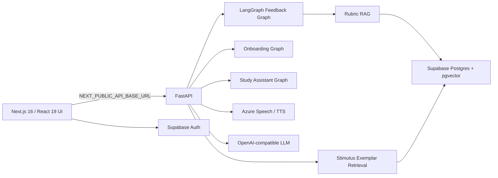

# EchoLingo Project Context

更新日期：2026-07-21

## Product

EchoLingo 是面向 PTE Academic 学习者的个人全栈 AI 练习平台。产品提供 15 个 Task Types 的单项练习、Mock Exam、结构化反馈、学习历史/统计、主题与弱项练习，以及学习辅助工具。

评分与反馈只用于学习参考。系统不复刻、不预测 Pearson 官方 PTE 总分，也不应把 EchoLingo 或 Azure 输出表述为官方评分。

权威术语和领域边界见仓库根目录 [`CONTEXT.md`](../CONTEXT.md)。

## Current Stage

PTE 产品 MVP 和平台架构已完成，当前进入 **Read Aloud Speech Evaluator** 阶段。

- 已完成：PTE 练习与 Mock、FastAPI 分离、LangGraph feedback、rubric RAG、Exemplar retrieval、Study Assistant、Onboarding、Supabase 同步、i18n。
- 当前运行：Azure Pronunciation Assessment 为 Read Aloud 和 Repeat Sentence 提供语音证据。
- 已完成：Speech Evaluator M0（WSL2 Ubuntu + RTX 4070 训练环境、`speech/` 包骨架、固定 encoder revision、smoke test）；模型本身尚未训练。
- 已确认但未实施：EchoLingo 自研 Read Aloud Speech Evaluator 模型训练、独立 GPU worker 服务、provider-neutral contract 和显式 compare mode。
- 当前权威计划：[`SPEECH_EVALUATOR_ROADMAP.md`](SPEECH_EVALUATOR_ROADMAP.md) 与 ADR 0011–0013。

## Runtime Architecture

FastAPI 是唯一业务后端。Next.js 中不存在 PTE、LLM、TTS、pronunciation 或 word lookup 的业务 API fallback；第三方密钥只属于 backend runtime。Next.js route handler 仅保留 Supabase auth callback 等前端平台职责。

## Frontend

- Next.js 16 App Router、React 19、TypeScript、Tailwind CSS 4。
- 主要页面：home、practice hub、15 个 task pages、mock、history、stats、vocabulary、settings、onboarding、admin。
- `src/lib/api-client.ts` 统一访问 FastAPI，并包含 timeout/circuit-breaker 行为。
- `src/lib/task-type-registry.ts` 是前端 Task Type 元数据入口；`src/data/task-types.json` 为 Python backend 提供共享 slug 列表。
- `usePracticeTaskRunner` 与 `useRecordingSession` 复用练习生命周期和录音状态。
- Supabase 不可用时，适用的数据层使用本地存储降级；这不代表业务 API 有本地 fallback。

## Backend

- FastAPI 入口：`backend/main.py`。
- HTTP routers：TTS、pronunciation、PTE stimulus、PTE feedback、word lookup、onboarding、Study Assistant。
- `feedback_graph.py`：rubric retrieval → pronunciation context → Primary/Judge 并行 → divergence check → optional retry → Coach → finalize。
- `onboarding_graph.py`：并行评估诊断任务，生成 weakness profile 与第一周计划。
- `study_assistant_graph.py`：最多四轮的工具调用循环；只能返回 allow-listed routes。
- 外部付费服务不得进入普通 CI/E2E；测试默认 mock LLM、Azure、Supabase 与 embedding 调用。

## API Authority

FastAPI 路由、OpenAPI 输出和 Pydantic models 是 API 的事实来源：

- 应用入口与 router 注册：`backend/main.py`。
- HTTP 路由：`backend/routers/`。
- 共享请求/响应模型：`backend/models/schemas.py` 与各 router 中的 Pydantic models。
- 本地运行时 API 文档：`http://localhost:8000/docs`。

本文件只记录 API 边界，不复制会随代码变化的完整 endpoint 或 schema 清单。需要静态 API 参考时，应由 ECC `/update-docs` 从上述来源生成并使用自动生成标记。

## Practice and Feedback

平台覆盖 Speaking & Writing、Reading、Listening 共 15 个 Task Types。调用方始终知道 `taskType`，因此没有 Router Agent（ADR 0004）。

Stimulus 路径：

- `random`：普通 Task Practice 与 Mock。
- `targeted`：根据 Task-Type Weakness 生成练习。
- `theme`：使用 pgvector dense + Postgres full-text sparse retrieval，并通过 RRF 融合。
- `news`：仅当 Study Assistant 检测到明确的实时/最新意图时使用 GNews 标题与摘要作为 anchor。

Exemplar 默认只作为 few-shot grounding，不向学习者逐字提供。生成结果经过本地 4-gram Jaccard originality guard；依赖失败时静默退化到纯 AI 生成（ADR 0008–0010）。

## Data

| Data | Authority | Notes |
|---|---|---|
| Auth/profile/history/vocabulary | Supabase | 客户端同步；部分能力有 localStorage fallback |
| Rubric chunks | Supabase pgvector | DashScope 1024-dim embeddings |
| Stimulus exemplars | Postgres + pgvector + `tsvector` | 迁移 004/005；最后确认 14,005 rows / 14 task types |
| ECDICT | Backend-local SQLite | 文件不进入普通 Git，部署时准备 |
| Prompt/rubric/task metadata | Repository | YAML、JSON 和 TypeScript registry |
| Speech datasets/checkpoints | Future external local storage | 必须通过 manifest 管理，不进入普通 Git |

根目录 `supabase-migration-001.sql` 至 `006.sql` 记录 schema 演进。某个 migration 文件存在不等于目标环境已经应用；部署前必须核对数据库状态。

## Speech Evaluation Boundary

### Current

- Read Aloud、Repeat Sentence：Azure 提供 word/phoneme 证据。
- 其他需要转录的口语任务：使用现有 STT/LLM 路径生成学习反馈。

### Confirmed target for Read Aloud

- 基于固定的 open pretrained speech encoder 构建 EchoLingo Speech Evaluator。
- 评估 pronunciation、oral fluency、prosody 与 reference-derived completeness/content。
- 默认 `echolingo` 与显式开发者 `compare` 是可见模式；Azure 不是静默 fallback。
- 模型运行在独立私有 GPU worker；FastAPI 通过 provider-neutral contract 调用。
- 10–90 仅为透明标注的 EchoLingo reference scale，直到独立 PTE-specific benchmark 支持校准。
- Repeat Sentence 不自动迁移，必须另行收集标签并校准。

## Quality and Safety Rules

- Frontend gates：`npm run lint`、`npm run typecheck`、`npm run test:unit:run`、`npm run build`。
- Backend gates：在 `backend/` 运行 `pytest`；按 CI 配置运行 ruff。
- E2E：`npm run test:e2e`，外部调用使用 mock-first 策略。
- 不在日志、客户端 bundle、截图或 committed fixtures 中放置密钥或学习者音频。
- 新业务与 LLM 逻辑进入 FastAPI，不恢复 Next.js API 业务分叉。
- 商业化、支付、订阅、排行榜、学习小组和社交分享保持 future/backlog，除非明确请求。

## Documentation Ownership

- 当前事实：本文件。
- 阶段与战略优先级：`ROADMAP.md`。
- Speech Evaluator 详细实施路线：`SPEECH_EVALUATOR_ROADMAP.md`。
- 已完成里程碑与验证：`DEVELOPMENT_LOG.md`。
- 决策理由：`adr/`。
- 领域术语：根目录 `CONTEXT.md`。
- 命令、依赖、路由和 schema：代码与 manifests；通过 ECC `/update-docs` 同步。
