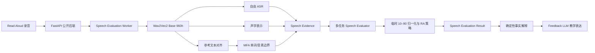

# EchoLingo Read Aloud Speech Evaluator 路线图

状态：已确认规划，尚未开始模型实现  
范围：第一代仅覆盖 PTE Academic Read Aloud  
优先级：先完成 Speech Evaluator，再启动 PTE Task Calibrator 与 Native Speech Model

## 1. 目标

第一代模型不是从零预训练语音基础模型，也不宣称生成官方 PTE 分数。它要完成一个真实、可训练、可验证的闭环：从 Read Aloud 录音中提取语音证据，学习句子、单词和音素层级的发音表现，输出 EchoLingo 10–90 参考评价，并在应用中替换 Read Aloud 的默认 Azure 评分路径。

第一代必须做到：

- EchoLingo 自己训练并拥有语音适配参数和多任务评分参数；
- 评分证据覆盖 Pronunciation、Oral Fluency、Content、单词和内部音素层级；
- 分数、证据、解释和模型来源可以追溯；
- 失败时明确拒绝评分，不生成看似可信的虚假结果；
- Azure 只在显式 Compare 模式中作为外部基线；
- 第一阶段完成后，结果可直接成为未来 PTE Tutor 的辅导上下文。

## 2. 非目标

第一代不包含：

- 从零训练 Wav2Vec2 或其他语音基础模型；
- 真实 PTE 10–90 分校准或官方等效声明；
- PTE Task Calibrator；
- Repeat Sentence 自研评分；
- 面向真实用户的生产 SLA；
- Native Speech Model、Tutor Conversation 或原生语音到语音训练；
- 把 Azure、竞品分数或整场官方 PTE 成绩当作单题训练真值。

## 3. 总体架构



### 3.1 明确的组件边界

| 组件 | 责任 | 不负责 |
|---|---|---|
| Wav2Vec2 Base 960h | 逐帧语音表示、CTC 转写概率 | PTE 分数 |
| 自由 ASR | 模型在不知道原文时实际听到的内容 | 单独决定 Content |
| 参考文本对齐 | 漏词、加词、重复、单词时间 | 判断发音好坏 |
| MFA | 第一代 ARPA 音素时间定位 | 发音评分真值 |
| Speech Evaluator | 句子、单词、音素、流利度与韵律预测 | 自由生成教学文案 |
| Provisional Score Normalization | 学习阶段 10–90 单调映射 | 声称对应真实 PTE |
| FastAPI | 鉴权、模式路由、公共契约、结果适配 | 加载 CUDA 模型 |
| Speech Evaluation Worker | 加载指定 Bundle 并执行 GPU 推理 | 对浏览器公开 |
| Feedback LLM | 基于固定事实组织建议 | 修改分数或发明错误 |

## 4. 数据策略

### 4.1 Foundational Speech Labels

[SpeechOcean762](https://github.com/jimbozhang/speechocean762) 是第一代评分监督锚点：

- 5,000 条非母语英语录音；
- 250 名普通话母语说话人，成人与儿童各约一半；
- 5 名专家分别评分；
- 句子级 Accuracy、Fluency、Completeness、Prosodic 与 Total；
- 单词级 Accuracy、Stress 与 Total；
- 音素级 0–2 评分和部分误读音素；
- CC BY 4.0，可用于商业与非商业用途。

官方训练与测试部分保持隔离。训练部分再按说话人划出 Validation，官方 Test 作为封存基准，不用于学习率、轮次、权重或阈值选择。

### 4.2 广泛语音适配

[Loquacious Small](https://huggingface.co/datasets/speechbrain/LoquaciousSet) 作为第一阶段唯一广泛语音适配池：

- 250 小时英语音频与转写；
- 包含朗读、自然语音、干净与噪声环境；
- 来源包括 VoxPopuli、LibriHeavy、YODAS、The People's Speech 和 Common Voice 18.0 等；
- 只用于 CTC ASR/对齐适配，不提供发音或 PTE 评分监督。

Common Voice 不再默认单独追加，因为 Loquacious 已包含 Common Voice 18.0。未来目标口音增量必须先完成来源、说话人和音频指纹去重。

### 4.3 数据仓库

```text
speech-data/
├─ raw/                 # 原始发布，只读
├─ processed/           # 可重建音频、MFA、特征
├─ benchmarks/          # 封存基准
└─ consented/           # 未来获授权的 EchoLingo 录音
```

每个 Speech Dataset Manifest 记录：

- 样本身份与文件哈希；
- 数据集和发布版本；
- 来源与许可；
- 说话人及 Training/Validation/Test 分区；
- 数据用途和未来用户数据的同意类别；
- 派生步骤与生成代码版本。

大型音频、特征缓存和权重不进入普通 Git。

## 5. 模型设计

### 5.1 第一代底座

固定使用 [`facebook/wav2vec2-base-960h`](https://huggingface.co/facebook/wav2vec2-base-960h)：

- Apache 2.0；
- CTC 输出可支持自由转写与参考文本对齐；
- 隐藏层提供逐帧声学表示；
- 尺寸适合 RTX 4070 12 GB 冻结训练和局部适配。

Whisper 保留为未来 ASR 对照，WavLM 保留为未来表示对照，不进入第一轮混合基线。

### 5.2 三层特征聚合

```text
Wav2Vec2 逐帧表示
├─ 音素区间池化 → 内部音素评分头
├─ 单词区间池化 → 单词 Accuracy / Stress 头
└─ 注意力统计池化 → 句子 Accuracy / Fluency / Prosody / Completeness 头
```

同时拼接可解释特征：

- 停顿次数、总占比与最长停顿；
- 发音时长、每秒单词数；
- 重复、假启动和自我修正；
- 音高与能量变化；
- 词间时长稳定性。

### 5.3 多任务损失

第一代固定起点：

```text
L_total
= 0.45 × L_sentence
+ 0.30 × L_word
+ 0.25 × L_phone
```

规则：

- 标签尺度先标准化；
- 每层级在有效标签内求平均；
- 低质量或失败音素对齐通过 Mask 排除；
- 长句不能因为音素更多而主导梯度；
- 权重只使用 Validation 调整；
- 动态权重只能作为独立候选实验。

### 5.4 音素能力

第一阶段使用 [MFA English US ARPA](https://mfa-models.readthedocs.io/en/latest/acoustic/English/English%20%28US%29%20ARPA%20acoustic%20model%20v2_0_0a.html) 生成离线音素边界。其输出只负责定位；SpeechOcean 专家标签才是评分监督。

运行时第一代也使用 MFA 以保持训练/推理一致：

- 音素对齐成功：可生成内部音素证据；
- 音素对齐失败：降级到句子与单词评价；
- 最低句子或单词证据不足：拒绝评分。

默认用户界面不展示完整音素列表。

## 6. 训练实验顺序

### A0：冻结基础评分基线

- 完整冻结 Wav2Vec2；
- 使用 SpeechOcean 官方聚合标签；
- 训练多任务评分网络；
- 不使用 Loquacious、LoRA 或动态损失；
- 建立可复现的最低基线。

### A0-Rater：评分者分歧候选

- 使用 `scores-detail.json` 中 5 名专家的原始评分；
- 内部学习中心分数和评分分歧；
- 不向用户显示置信度或分歧；
- 只有基准提升才替换 A0 聚合标签方案。

### A0-Aug：轻量增强候选

允许：轻度噪声、音量、房间响应、编码效果和保守特征 Mask。  
禁止：明显变速、变调、裁剪、TTS 高分样本和继承原标签的合成错误。

### A1-Encoder：Loquacious CTC Adapter

- 使用 Loquacious 音频与转写训练 CTC LoRA/Adapter；
- 验证 WER、对齐覆盖和噪声鲁棒性；
- 不将 Loquacious 作为评分标签。

### A1-Scorer：适配表示上的评分候选

- 加载 A1 Encoder；
- 冻结大部分编码器；
- 使用 SpeechOcean 训练评分头；
- 与 A0 使用同一个封存 Speech Evaluation Benchmark 比较。

### 成人目标域候选

- 成人与儿童都参与基础监督；
- Batch 平衡年龄组；
- 成人测试结果是主要升级指标；
- 比较“全体训练”与“全体训练后成人轻微微调”；
- 年龄不作为线上评分输入。

## 7. 评估与验收

### 7.1 多指标基准

句子级：Pearson、Spearman、MAE、分数段误差。  
单词/音素级：MAE、错误检测 Precision/Recall、Macro F1。  
证据链：WER、单词对齐成功率、音素对齐合格率。  
鲁棒性：干净、噪声、混响、异常与截断音频。  
分组：成人/儿童、性别、说话人与其他可用元数据。

任何单一指标都不能独立决定模型升级。

### 7.2 Speech Evaluator Acceptance

个人开发环境默认启用的最低门槛：

- 数据和说话人隔离审计通过；
- 两次等价训练结果合理稳定；
- 句子 Accuracy 和 Fluency 与封存专家标签相关系数均至少 0.60；
- 句子、单词与音素预测优于无学习基线；
- 异常音频、非英语和对齐失败安全处理；
- Azure Compare Adapter 仍可工作。

这些是个人学习阶段工程门槛，不代表 PTE 校准完成或可公开发布。

### 7.3 有效性边界

- SpeechOcean 的评分有效性主要覆盖普通话母语英语学习者；
- Loquacious 可以提高识别鲁棒性，但不能证明跨口音评分公平；
- 第一代不把地区口音本身当作错误；
- 未来跨口音有效性必须依赖带人工标签的独立分组基准。

## 8. 10–90 参考评价

在 PTE Task Labels 不足时，保留模型原始尺度，并通过单调 Provisional Score Normalization 显示 10–90：

```text
RA 参考总分
= 40% Pronunciation
+ 40% Oral Fluency
+ 20% Content
```

Content 同时执行门控：

- 无有效语音或完整非英语响应：返回最低结果；
- 几乎没有读出原文：严重封顶；
- 只读出少量内容：限制最高结果；
- 大部分内容有效：按三个维度正常计算。

该公式明确标注为 EchoLingo 学习阶段策略，不声称是 Pearson 公式。

## 9. 运行与部署

### 9.1 本地环境

标准语音环境运行在 WSL2 Ubuntu：

- Windows 安装 NVIDIA 主机驱动；
- WSL 不安装 Linux 显示驱动；
- PyTorch CUDA、Transformers、MFA、MLflow 和 Worker 留在独立环境；
- 数据和特征优先放在 WSL Linux 文件系统；
- Windows FastAPI 通过配置地址访问 Worker。

参考：[NVIDIA CUDA on WSL](https://docs.nvidia.com/cuda/wsl-user-guide/)

### 9.2 进程边界

```text
Next.js                 http://localhost:3000
FastAPI                 http://localhost:8000
Speech Evaluation Worker http://localhost:8100
MLflow UI               http://localhost:5000
```

端口均可配置，端口不是模型身份。

### 9.3 Checkpoint Bundle

每个通过验收的模型导出不可变 Bundle：

```text
speech-evaluator-v0.1.0/
├─ scoring-head.safetensors
├─ adapter.safetensors
├─ model-config.json
├─ feature-schema.json
├─ label-schema.json
├─ normalization.json
├─ training-manifest.json
├─ dataset-manifest.json
├─ benchmark-results.json
└─ LICENSES.md
```

Worker 只能加载明确配置的 Bundle，不能自动加载“最新文件”。

### 9.4 实验追踪

所有 Evaluator Training Run 进入本地 MLflow，记录数据清单、Git commit、随机种子、超参数、训练曲线、多指标结果、GPU、训练时间与峰值显存。只有通过验收的 Run 能导出 Bundle。

## 10. 应用集成

### 10.1 代码组织

```text
speech/
├─ configs/
├─ src/echolingo_speech/
│  ├─ data/
│  ├─ alignment/
│  ├─ features/
│  ├─ models/
│  ├─ training/
│  ├─ evaluation/
│  ├─ bundles/
│  └─ worker/
└─ tests/
```

现有 `backend/` 只增加轻量 HTTP Client、Provider Adapter 与模式编排，不安装 PyTorch、CUDA、MFA 或 MLflow。

### 10.2 Speech Evaluation Result

新接口使用提供方无关契约：

```json
{
  "taskType": "read_aloud",
  "provider": "echolingo",
  "taskScore": 74,
  "dimensions": {
    "pronunciation": 72,
    "oralFluency": 68,
    "content": 91
  },
  "recognizedText": "...",
  "words": [],
  "evidenceStatus": {
    "sentence": "available",
    "word": "available",
    "phoneme": "available"
  },
  "label": "EchoLingo参考评价"
}
```

旧 Azure `/api/pronunciation` 契约仅承担迁移兼容，前端迁移后可删除。

### 10.3 Read Aloud 模式

`echolingo`：默认，只运行自研模型，失败明确返回，不自动 Azure 回退。  
`compare`：显式运行 EchoLingo 与 Azure，开发者查看并列诊断。

Repeat Sentence 暂时保持现有 Azure Pronunciation Assessment；Azure TTS 不受影响。

### 10.4 延迟与失败

- 第一代同步请求预算为 30 秒；
- Worker 启动时加载模型；
- Compare 并行调用两个 Provider；
- 单方失败可返回 Partial；
- MFA 临时文件始终清理；
- 只有实测延迟证明同步不足时才引入队列或流式进度协议。

## 11. 用户反馈设计

普通 Read Aloud 页面只展示一套主结果：

- Pronunciation、Oral Fluency、Content、RA 参考总分；
- 所有可靠低分单词标红；
- 漏词、错词、加词与重复具有不同状态；
- 所有显著流利度问题在对应位置标识；
- 点击低分单词显示单词分和简短、可支持的问题类别；
- 不展示完整音素列表；
- 页面顶部提供少量优先练习摘要。

内部保留完整音素分、音素区间、对齐质量和原始模型输出。

开发者 Compare 面板展示：

- 两个 Provider 的维度分和差值；
- 双方识别文本；
- 单词判断分歧；
- EchoLingo 对齐状态；
- Provider 延迟与错误。

## 12. 解释权限

```text
Speech Evaluator
→ 固定分数和结构化事实

确定性解释层
→ 将事实转成可核查描述

Feedback LLM
→ 组织教学语言与建议
```

LLM 不得：

- 修改任何分数；
- 新增未检测到的单词或音素错误；
- 把缺失证据描述成已确认事实；
- 声称结果是官方 PTE 分数。

## 13. Compare 数据与隐私

默认保存结构化比较结果、差值、证据状态、Checkpoint ID、时间与不可逆录音哈希。默认不保存原始音频、逐帧特征、可复用声音向量、MFA 临时文件或重复题目文本。

开发者可以显式限时保留自己的调试录音。未来任何用户原始音频保留和模型训练都需要独立 Training Consent。

## 14. 实施里程碑

### M0：环境与骨架

- WSL2 GPU 验证；
- `speech/` 包骨架；
- 数据和 Artifact 根目录；
- MLflow 本地追踪；
- 单元测试与配置校验。

### M1：SpeechOcean 数据管线

- 下载、校验与许可清单；
- 固定说话人切分；
- MFA 对齐和质量报告；
- 特征提取；
- 封存基准锁定。

### M2：A0 冻结基线

- Wav2Vec2 特征；
- 三级池化；
- 多任务评分头；
- 固定损失；
- 两次稳定训练；
- 多指标基准报告。

### M3：候选改进

- 评分者分歧候选；
- 轻量增强候选；
- 成人目标域候选；
- Loquacious CTC Adapter 与 A1 Scorer；
- 只保留被基准支持的改进。

### M4：Bundle 与 Worker

- Bundle 导出、校验和加载；
- 私有 Worker；
- 启动加载、健康检查和超时；
- 句子/单词/音素分层降级。

### M5：FastAPI 与 Read Aloud

- Provider-neutral V2 契约；
- EchoLingo Provider Client；
- Azure Compare Adapter；
- Read Aloud 默认 EchoLingo；
- 旧 Azure 专用契约迁移。

### M6：反馈与诊断

- 单词级完整标注；
- 流利度事件标注；
- 重点建议摘要；
- Compare 开发者面板；
- 结构化比较持久化与隐私清理。

## 15. 第一代正式完成定义

第一代只有在以下全部完成后才算完成：

- SpeechOcean 数据、许可、固定切分、MFA 与泄漏审计完成；
- A0 多任务模型和至少两个稳定 Run 完成；
- A1 Loquacious 候选完成并与 A0 比较；
- 达到 Speech Evaluator Acceptance；
- 通过验收的 Run 导出完整 Checkpoint Bundle；
- Worker 在 WSL2 使用 RTX 4070运行；
- FastAPI 和 Read Aloud V2 接入完成；
- EchoLingo-only 与显式 Compare 行为正确；
- 完整单词和流利度标注完成；
- Compare 开发者面板完成；
- 自动化测试、基准报告和限制说明齐全。

## 16. 后续阶段

### PTE Task Calibrator

只有获得足够、合法、任务级、覆盖目标人群的 PTE Task Labels 后才启动。第一代 Calibrator 是独立小模型，基础 Speech Evaluator 先冻结；它必须在独立 PTE 黄金基准上超过 40/40/20 临时策略。

具体最低样本数量尚未最终确认，不把 Azure、竞品分数或整场 PTE 成绩替代为任务级真值。

### Native Speech Model

在 Speech Evaluator 完成后启动。它读取已接受的 Speech Evaluation Result 进行 Tutor Conversation，不重新生成另一套发音分数；Tutor Goal、Tutor Check、Recovery Segment、固定国际英语 Tutor Voice 与原生语音到语音训练属于后续独立路线。

## 17. 主要风险

| 风险 | 应对 |
|---|---|
| SpeechOcean 训练录音较少 | 冻结底座、小评分头、严格封存测试 |
| 一半为儿童 | 全体训练、成人主指标、成人候选微调 |
| 全部为普通话母语者 | 限定有效性声明，未来补充带标签跨口音基准 |
| MFA 强制错误边界 | 质量过滤、Mask、分层降级 |
| Loquacious 无评分标签 | 只做 CTC 适配，评分仍由 SpeechOcean 监督 |
| Azure 自动回退掩盖问题 | Read Aloud 禁止静默回退，只在 Compare 调用 |
| 10–90 被误认为 PTE | 明示 EchoLingo 参考评价，保留原始尺度 |
| LLM 发明错误 | 分数与事实先固定，LLM 只组织表达 |
| 实验不可复现 | MLflow、Manifest、固定 revision、Bundle |

## 18. 已确认但尚未实施

本文档、`CONTEXT.md` 与 ADR-0011/0012/0013 记录的是已确认方向。目前没有创建 `speech/` 包、下载训练集、安装 WSL2 依赖、训练模型或修改运行时接口。实施必须从 M0 开始，并在每个里程碑完成后记录真实验证结果。
