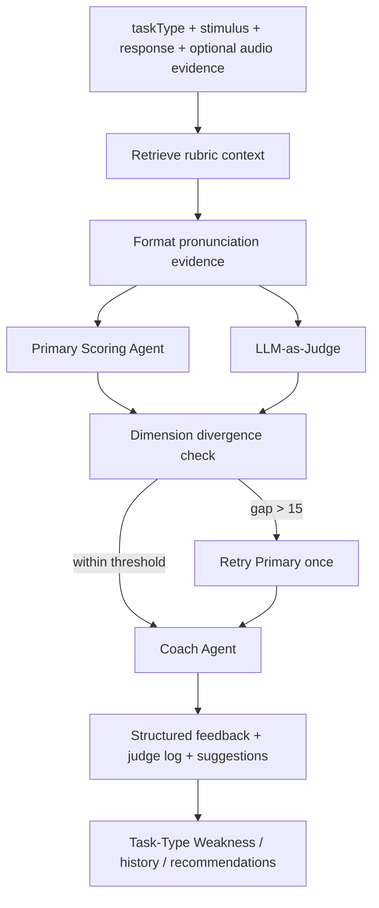
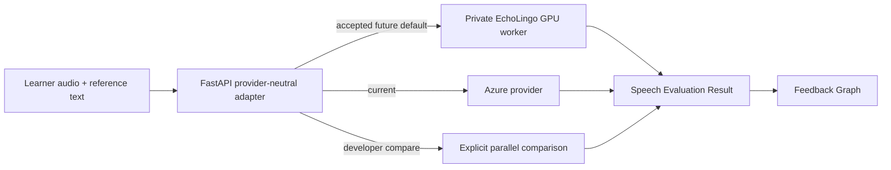

# EchoLingo Agent Architecture

更新日期：2026-07-21

EchoLingo 中的 **Agent** 专指反馈/评分管线中的职责节点。面向学习者的 Study Assistant 虽然使用工具调用，但产品术语仍称 **Study Assistant**，不与反馈 Agent 混用（ADR 0004、0010）。

## Feedback Graph

实现入口：`backend/services/feedback_graph.py`。FastAPI router 只负责 HTTP validation 与调用，不复制业务逻辑。

## Responsibilities

| Component | Responsibility | Status |
|---|---|---|
| Rubric retrieval | 按 `taskType` 从 pgvector 检索评分依据 | Implemented |
| Speaking evidence | 把当前 Azure pronunciation 或其他 speech evidence 转为评分上下文 | Implemented；Read Aloud 自研替换尚未开始 |
| Primary Scoring Agent | 依据 task-specific rubric 生成维度反馈 | Implemented |
| LLM-as-Judge | 独立评分并检测单维度差异 | Implemented |
| Retry policy | 任一维度差值大于 15 时最多重试 Primary 一次 | Implemented |
| Coach Agent | 基于弱项与 rubric 生成可执行建议 | Implemented |
| Diagnosis/Profile | 从历史聚合 Task-Type Weakness | Implemented（应用层） |

## No Router Agent

学习者在进入练习前已经选定 Task Type，请求中始终显式传入 `taskType`。把已知枚举分派给对应 rubric/处理器只是普通代码路径，不需要模型推断，也不应包装成 Router Agent（ADR 0004）。

## Study Assistant Boundary

Study Assistant 是独立的 learner-facing LangGraph tool loop：

- `navigate_app`：只返回 allow-listed routes。
- `generate_practice`：生成主题练习 deep link；默认 Exemplar grounding，明确实时意图才使用 news anchor。
- `pte_knowledge`：回答产品内 PTE 知识问题。

它不会提交 Response、触发评分、修改历史或调用 feedback Agents。会话仅保存在当前前端 session。

## Speech Evaluator Transition

当前 Read Aloud 与 Repeat Sentence 的 pronunciation evidence 来自 Azure。目标 Read Aloud 架构如下：

关键限制：

- EchoLingo provider 通过验收后才成为 Read Aloud 默认值。
- Azure 只在显式 compare 模式参与对照，不作为静默 fallback。
- Worker 失败时返回明确的不可用结果，不能伪造分数。
- Repeat Sentence 保持现有路径，直到拥有独立标签、benchmark 和 calibration。
- 详细训练、评估和部署计划见 `SPEECH_EVALUATOR_ROADMAP.md` 与 ADR 0011–0013。

## Evaluation Notes

- Judge disagreement rate 是 prompt/模型回归指标，不等于评分准确率。
- Promotion 需要固定回归集、维度级误差、稳定性和 subgroup 检查，不能只看单一平均分。
- 用户可见分数是学习参考，不应使用“官方”“预测 PTE 总分”等表述。
