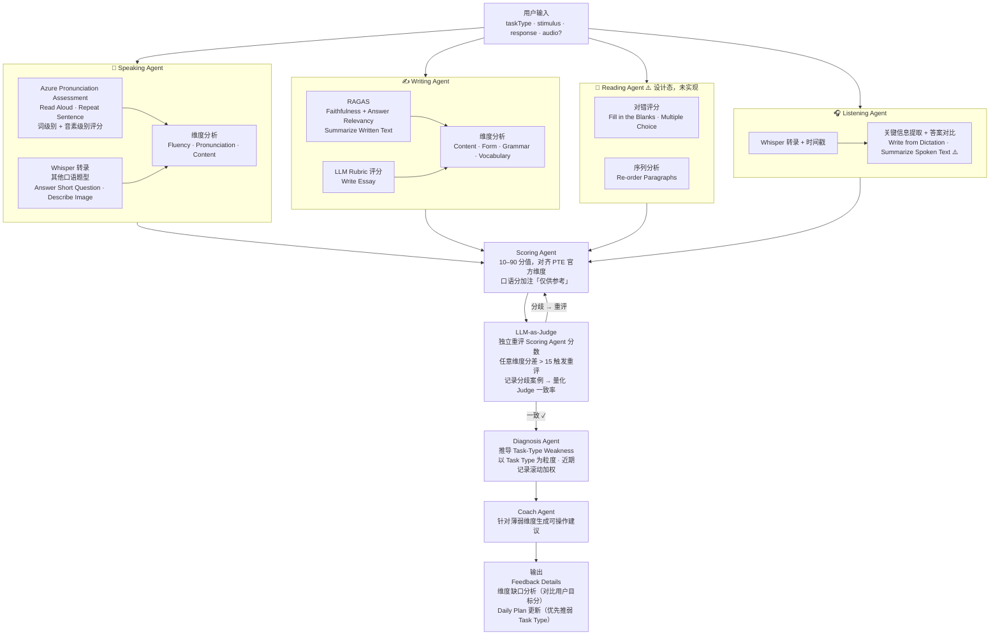

# EchoLingo Agent Architecture



## 关键设计决策

| 决策 | 选择 | 理由 |
|---|---|---|
| 无 Router Agent | 题型由调用方直接传入 | taskType 始终已知，路由层没有实际判断价值 |
| Azure PA vs Whisper | Azure 做发音评分，Whisper 做其他题型转录 | Azure 提供音素级别数据，Whisper 只有时间戳 |
| 评分范围 | 10–90，对齐 PTE 官方维度 | Reading/Writing 维度客观可测；Speaking 加免责标注 |
| RAGAS 范围 | 仅用于 Summarize Written Text | Write Essay 无 context，RAGAS 不适用 |
| LLM-as-Judge 阈值 | 任意维度差值 > 15 分触发重评 | 规则简单可解释，分歧率可量化 |
| 用户画像粒度 | Task Type 级别 | Section 级别聚合会丢失诊断信息 |
| 学习轨迹 | 缺口分析（对比目标分） | 不预测绝对考试分数，避免不可验证的承诺 |

## 实现状态

| 组件 | 状态 |
|---|---|
| Speaking Agent（Read Aloud, Repeat Sentence, Answer Short Question） | ✅ 已实现 |
| Writing Agent（Summarize Written Text, Write Essay） | ✅ 已实现 |
| Listening Agent（Write from Dictation） | ✅ 已实现 |
| Reading Agent | 🔵 设计完成，待实现 |
| Listening Agent（Summarize Spoken Text, FitB, Highlight Correct Summary） | 🔵 设计完成，待实现 |
| Scoring Agent · Diagnosis Agent · Coach Agent | ✅ 核心逻辑已实现（task-weakness.ts · recommendations.ts） |
| LLM-as-Judge | 🔵 设计完成，待实现 |
| 学习轨迹可视化 | 🔵 设计完成，待实现 |
```
